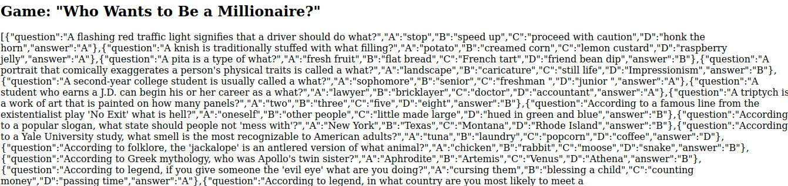
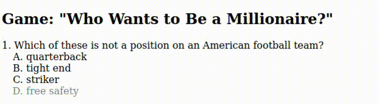
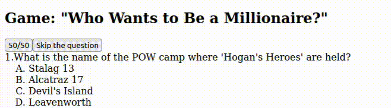
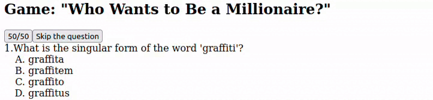
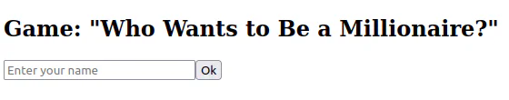
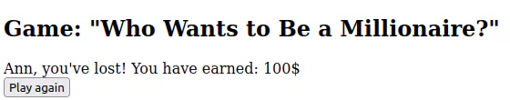

# who wants to be a millionaire

- [who wants to be a millionaire](#who-wants-to-be-a-millionaire)
  - [learning](#learning)
  - [about](#about)
  - [stages](#stages)
    - [1: connecting to a json file](#1-connecting-to-a-json-file)
    - [2: structure of the game](#2-structure-of-the-game)
    - [3: structure of the game](#3-structure-of-the-game)
    - [4: hit the bank](#4-hit-the-bank)

## learning
you will learn how to handle browser events, work with json objects, and program game logic using js. this will save you from the fear of using javascript!

## about
some may think that front-end development is only about manufacturing similar web pages like online shops or landings. but the things you can program with html, css, and js are infinite and bounded with only your imagination. 

browser games are one of the items on this list because they do not always require a server, which means you can apply your skills and knowledge in the interface to create your own game, which is what the project is about. when creating a game, the emphasis will be on js. therefore, we will almost not use html and css here, and all html markup will be done using js.

## stages
### 1: connecting to a json file
<details>
<summary>connect a file with questions and answer options.</summary>

#### 1.0 theory
`fetch` is the method for sending a network request to the server, so you can both get and send data.

the `fetch(url, options)` function takes two parameters:
- the url to make the request to;
- `options` (optional) is a configuration object where you can configure the `request` method, request body, headers, and so on.

the result of the `fetch()` call will be a promise, which contains a special response object. this object has two important fields:
- `ok` accepts the true or false status and reports the success of the request;
- the `json` method; once is called, it returns the result of the request in the form of json.

but when accessing a local file via `fetch`, there may be a problem with the same origin policy, which prohibits making requests to resources located in another domain.

in most browsers, such requests to local files are not allowed by default, which may cause a cors (cross-origin resource sharing) error. to work around this problem, you can use a local server, such as an `http-server`, which will allow you to run files on the local host and bypass the cors policy.

to install:
`npm install -g http-server`
starting from the directory where the html file is located:
`http-server --cors`
url becomes as follows:
`const url = 'http://127.0.0.1:8080/question.json';`

>make sure you're running the local server while running the checks for the project. you should run the local server in the directory where the html file is located and it's important that you use the above url.

#### 1.1 description
welcome to the first stage! in this stage, you need to get the file's contents by reference.

notice the json file in the project folder. you will use the json file named `question.json`.

this stage is simple, but very important since the file contains questions and various answers, among which one is correct. all the content will be used for our game to display information on the screen.

questions and answers will be displayed on the page, but don't worry, it's only in this stage, to check out if the json file is connected. then you should clear the page.

#### 1.2 objectives
as a result of the stage, you should have a `game()` function that accepts a url with a json file. at the output on the page in the block with `id=container`, there should be an array with questions, answers, and the correct answer.

#### 1.3 examples



</details>

### 2: structure of the game
<details>
<summary>add functions for displaying questions and answer options, with checking answers.</summary>

#### 2.1 description
the second stage is where you develop the game logic. as you have already noticed, questions and answers are stored as objects. objects allow you to group data (for example, variables) into a single object that is easy to use. thus, the question, possible answers, and one correct answer will be part of one object. for the convenience of displaying an object, it is better to use a list. this object will be randomly selected and displayed on the screen. beware, no more than 15 questions.

we will also check the answer for correctness. when you click on the answer, we check whether it is correct. if yes, then proceed to the next question. otherwise, we display a message about the loss. to check whether the answer provided by the user is correct, you should simply compare it with the field of a specific object.

there is a recommendation on how to switch levels. only a few things can happen at one level, so it's worth trying conditional operators to make everything work. if this answer is correct, the level increases, and the next iteration begins. otherwise, the game ends.

for the convenience of reading the code, create a separate function for each action (for example, the output of questions, checking the answer, etc.).

>do not forget that in order for the code to work correctly and the tests to pass, it is necessary to use a local server:
>`http-server --cors`

#### 2.2 objectives
this stage is probably the toughest, but the most interesting. in the output, you should have:
- function for the output of questions and answer options;
- function to check the user's response.

get the answer the user sent by clicking on one of the answers and check whether it's correct or not;
```javascript
let checktheanswer = () => {
  useranswer === correctanswer ? continue : break;
}
```

- switch levels depending on the given answers;
- output no more than 15 questions.

```javascript
let questionnumber = 0;

let outputrandomquestions = () => {
  let dataquestion = datajson[random];

  if (questionnumber < 15) {
	questionnumber++;
	...
  }
}
```

#### 2.3 examples



</details>

### 3: structure of the game
<details>
<summary>add hints to the game</summary>

#### 3.1 description
in this stage, you will add hints to the game.

as in the real tv show, our game should provide the user with hints, but we will make the task a little easier for ourselves and output only two hints. you will have the 50/50 hint (the ability to leave 2 out of 4 answers) and skip the question feature.

the 50/50 hint assumes that one answer is correct and the other is incorrect. therefore, we need to ensure that one correct one is output and the other is randomly selected from the other three incorrect ones.

like in a real game, the hint can be used only once. therefore, after using the hint, it is necessary to hide it. do not delete from the dom, it may cause errors.

>do not forget that in order for the code to work correctly and the tests to pass, it is necessary to use a local server:
>`http-server --cors`

#### 3.2 objectives
by the end of it, your program should:
- provide all hints;
- have the button with `id=fiftyfiftybtn` when you click on the button, we output two answers — one is correct, the other is not ;
- have the button with `id=skipthequestionbtn` when you click on the button, go to the next question;
- hide the hint button if it was pressed.

#### 3.3 examples
**example 1**: _using the 50/50 hint_


**example 2**: _using the skip the question hint_


</details>

### 4: hit the bank
<details>
<summary>add a bank counter and the ability to enter a name</summary>

#### 4.1 description
when the game starts, enter the name and click "ok" to go to the game. after completing the game, we will display an end message with the amount of money earned. if you win the game, display a victory message or show that the user lost it with the name entered. there should be a button to play the game again. also, the player should win 100$ with each correct answer.

>do not forget that in order for the code to work correctly and the tests to pass, it is necessary to use a local server:
>`http-server --cors`

#### 4.2 objectives
by the end of the stage, your code should have:
- one input field with `id='input__user-name'` to enter the name;
- a paragraph with `id='game-end'` to display a message about the end of the game, which will also show the name entered in the input and the amount of money earned during the game.
- a button to play again.

#### 4.3 examples

**example 1:** _entering a name_


**example 2:** _message of the game ends_


</details>

[<<](https://github.com/eucarizan/front-end/blob/main/README.md)
<!--
:%s/\(Sample \(Input\|Output\) \d:\)\n\(.*\)/```\r\r**\1**\r```\3/gc

### 0: 
<details>
<summary></summary>

#### 0.1 description

#### 0.2 objectives

#### 0.3 examples


</details>
-->

